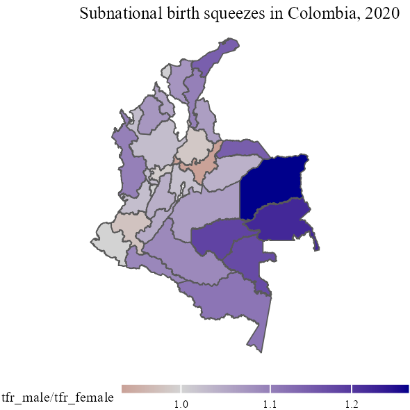

June 2024, Rostock

## Colombian Vital Statistics Data
This repository contains the code to unpack, clean, and combine the Colombian register data for the period between 2000 and 2020.

# Code-pipeline
You should be able to reproduce the resuls by running the [Meta-File](META.R) file in the main directory. 

# Packages

- haven
- data.table
- tidyverse
- xlsx
- sf